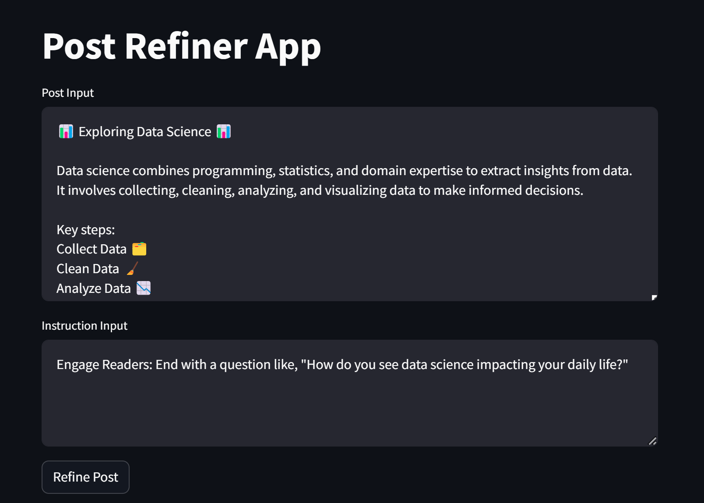
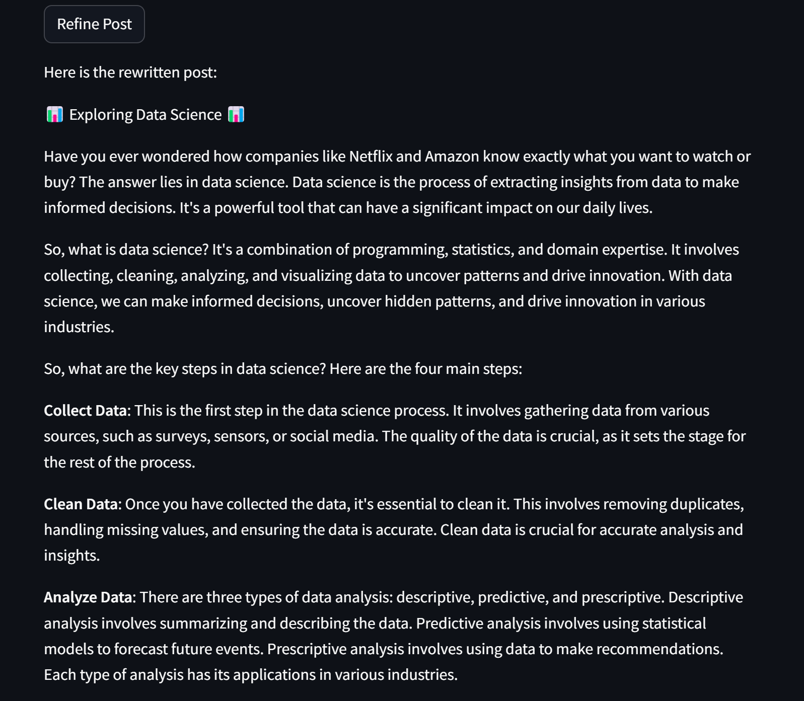

# 🎉 Post Refiner App 🎉

Welcome to the **Post Refiner App**! This app helps you refine your posts and bring out the best version of them with just a few clicks.

---

## ✨ Features ✨

- **Instruction Input**: Provide specific instructions on how you want to improve your post.
- **Post Input**: Enter the post you want to refine.
- **Magic Refinement**: Our app processes your input and provides a refined version of your post.
- **Spinner Indicator**: See a spinner while the magic happens, so you know the app is working.

---

## 🚀 Getting Started

### Prerequisites

Make sure you have Python installed on your system. If not, download and install it from [here](https://www.python.org/downloads/).

### Installation

1. **Clone the repository**:

    ```bash
    git clone https://github.com/timothyafolami/Post-Assistant
    cd post-refiner-app
    ```

2. **Install the required packages**:

    ```bash
    pip install --r requirements.txt
    ```

3. **Run the app**:

    ```bash
    streamlit run post_app.py
    ```

### Usage

1. **Enter your instructions**: Provide details on how you want to improve your post.
2. **Paste your post**: Enter the post you want to refine.
3. **Click "Refine Post"**: Let the app do its magic!
4. **Get your refined post**: Voila! Your post is now refined and ready to shine.

---

## 📸 Screenshots




---

## 🎁 My Birthday Gift for You All 🎁

Enjoy using this app to make your posts perfect! 🎂🎈

---


---

## 💖 Acknowledgments

- Thanks to the Streamlit team for making app development so easy and fun.
- Special thanks to everyone who has supported me.

---

*Happy Posting!* 😊
